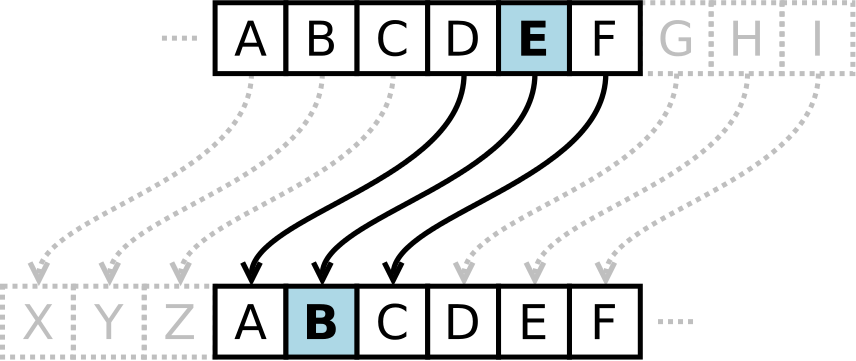

#Learn Cryptography

First and most basic method is Caesar Cipher

**Caesar Cipher**

According to <https://learncryptography.com> The **Caesar Cipher**, also known
as a shift cipher, is one of the oldest and simplest forms of encrypting a
message. It is a type of substitution cipher where each letter in the original
message (which in cryptography is called the plaintext) is replaced with a
letter corresponding to a certain number of letters shifted up or down in the
alphabet.

For each letter of the alphabet, you would take its position in the alphabet,
say 3 for the letter 'C', and shift it by the key number. If we had a key of +3,
that 'C' would be shifted down to an 'F' - and that same process would be
applied to every letter in the plaintext.

In this way, a message that initially was quite readable, ends up in a form that
cannot be understood at a simple glance. 

undefined

For example, here's the Caesar Cipher encryption of a full message, using a left
shift of 3. 

Plaintext:  
THE QUICK BROWN FOX JUMPS OVER THE LAZY DOG

Ciphertext:  
QEB NRFZH YOLTK CLU GRJMP LSBO QEB IXWV ALD

As unreadable as the resulting ciphertext may appear, the Caesar Cipher is one
of the weakest forms of encryption one can employ for the following reasons:

-   The key space is very small. Using a [brute force
    attack](https://learncryptography.com/attack-vectors/brute-force-attack) method,
    one could easily try all (25) possible combinations to decrypt the message
    without initially knowing the key. 

-   The structure of the original plaintext remains intact. This makes the
    encryption method vulnerable to [frequency
    analysis](https://learncryptography.com/attack-vectors/frequency-analysis) -
    by looking at h ow often certain characters or sequences of characters
    appear, one can discover patterns and potentially discover the key without
    having to perform a full brute force search.

More can be referred from
<https://learncryptography.com/classical-encryption/caesar-cipher>

I have made four programs, one for encryption, which will take message as string
and shift as number, decryption which will take cipher and shift, one for brute
force attack.

**Brute Attack** here means we will try all the 25 combinations so we won’t need
any shift. Caesar Cipher is very easy to crack. We will discuss Frequency
analysis later.

Code for encryption is
[HERE](https://github.com/jimmyahalpara/Cryptography/blob/master/Ceaser%20Cipher/Encrypter.py)

Code for decryption is
[HERE](https://github.com/jimmyahalpara/Cryptography/blob/master/Ceaser%20Cipher/Decrypter.py)

Code for brute attack is
[HERE](https://github.com/jimmyahalpara/Cryptography/blob/master/Ceaser%20Cipher/Brute%20attack.py)

Here in our case we will have 26 keys one including space.
